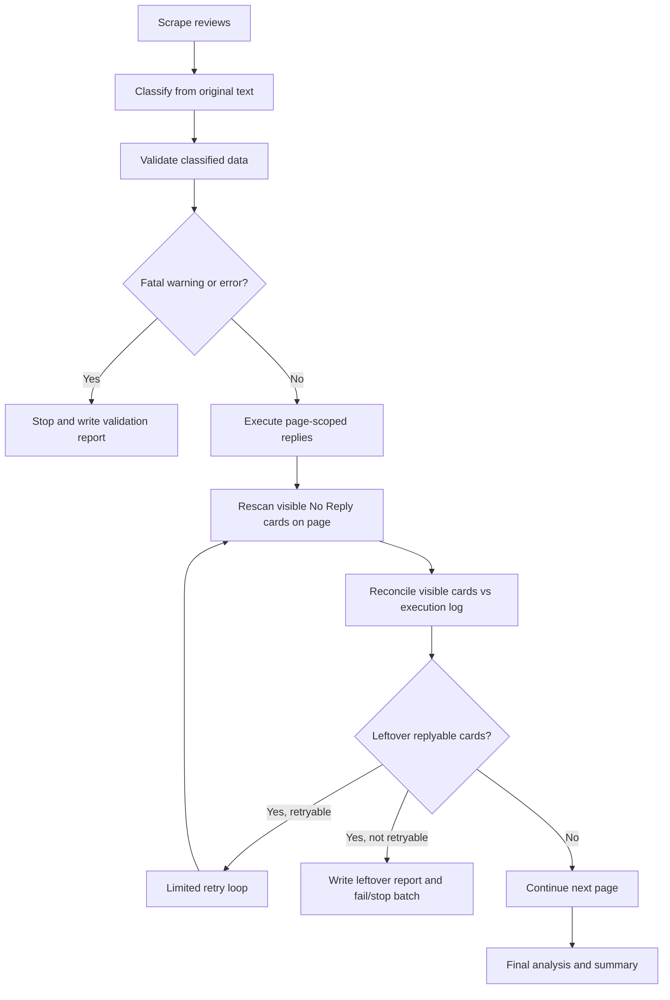

# Reconciliation Loop Implementation Plan

Created: 2026-06-29

Goal: make sure the agent does not silently miss replyable reviews, does not
create noisy `card_not_found` failures for reviews from other pages, and always
produces a clear comparison between classified data, current UI state, and live
execution logs.

## 1. Context And Diagnosis

Observed UI symptoms:

- Reviews still appeared in the `No Reply` filter after the agent had run.
- Some reviews were skipped without a clear reason in the logs.
- Older logs had too many `card_not_found` rows, which made real failures hard
  to separate from page-scope mismatches.

Latest code and log findings:

- `apps/bugzz/logs/review_log_analysis.json` had 1109 rows:
  - `sent`: 159
  - `skipped_uncertain`: 201
  - `failed`: 749
  - `card_not_found`: 700
  - `reply_content_not_confirmed_after_template_click`: 47
- `tools/volio_review_agent.py::run_reply_from_classified` passed all
  classified reviews into every page execution.
- `tools/volio_review_agent.js::replyFromClassified` looped through all
  classified rows on the current page and matched cards by `username + rating`.
- When classified rows belonged to other pages, the current page produced many
  `card_not_found` rows. This was failure noise, not a real per-review failure.
- `tools/volio_review_agent.js::getReviewCardsFromPage` skipped cards when
  `cardText` contained `@volio.group`, `@volio.vn`, or `Reply from`. If
  `findClosestReviewCard` returned a container that was too broad, an unreplied
  card could be misread as already replied because a neighboring card had a
  reply block.
- The validator already had guardrails for skipped rows that looked replyable,
  but the workflow still needed a post-execution question: "Which visible
  replyable reviews remain on the UI but do not appear in sent/skipped/failed
  logs?"

Conclusion:

- Add a reconciliation loop after each page and after the full batch.
- Execute only page-scoped classified rows.
- Log every visible review, including reviews skipped by DOM/card detection.
- Always write a leftover report showing what remains and why.

## 2. Design Principles

1. No silent skip.
   Every visible review in `No Reply` must become one of: `sent`,
   `skipped_with_reason`, `failed_with_reason`, `already_replied`, or
   `leftover_unprocessed`.

2. Execute by page scope.
   On page N, only send classified rows whose `pageUrl` or `page_number`
   matches page N, or whose identity intersects with visible cards on page N.

3. UI is the final reconciliation source.
   After a page run, rescan visible cards on that page and compare them against
   the execution log.

4. Identity must be stronger than `username + rating`.
   Use `username`, `rating`, `reviewDate`, `review_original_text`,
   `reviewLanguage`, and a normalized text hash.

5. Already-replied detection must stay inside the correct card boundary.
   Do not infer from a broad `card.innerText` container. Find the reply block
   inside the exact review card.

6. Retry is limited.
   Retry transient UI failures only. Do not retry ambiguous or guardrail-blocked
   reviews automatically.

7. Logs must support audit and product insight.
   Besides send status, log intent, template, aliases tried, original text,
   translated text, page, loop, attempt, matched card, and skip reason.

## 3. Scope

### In Scope

- Add browser-side reconciliation APIs in `tools/volio_review_agent.js`.
- Update `tools/volio_review_agent.py` to execute page-scoped rows and collect
  post-run reconciliation.
- Extend CSV/JSON log schema.
- Update `tools/analyze_log.py` to read leftover reports.
- Keep `docs/volio_review_agent_sop.md` aligned with the new loop.
- Add unit tests for identity, page filtering, skip validation, and log
  analysis.

### Out Of Scope

- Do not change saved reply template content.
- Do not edit templates in the Volio UI.
- Do not add free-text AI reply generation.
- Do not change classification business rules unless the implementation exposes
  a directly related regression.

## 4. Proposed Flow



## 5. Files And Functions

### `tools/volio_review_agent.js`

Add or update:

- `getVisibleReviewSnapshot(options)`
- `getVisibleReplyableReviews(options)`
- `isAlreadyRepliedCard(card)`
- `getReviewCardIdentity(card)`
- `normalizeReviewIdentity(input)`
- `matchVisibleCardToClassified(cardSnapshot, classifiedItems)`
- `replyFromClassifiedPageScoped(classifiedReviews, options)`
- `reconcileCurrentPage(executionRows, classifiedReviews, options)`
- `replyFromClassifiedLoop(classifiedReviews, options)`

Update existing behavior:

- Keep `findClosestReviewCard(element)` within the real card boundary.
- Make `getReviewCardsFromPage(options)` use `isAlreadyRepliedCard(card)`.
- Make `toLogRow(item, status, error)` include identity and validation fields.
- Make `selectTemplate(card, decision, options)` report aliases tried.
- Keep `replyFromClassified(classifiedReviews)` as a compatibility wrapper if
  needed, but route new live work through the page-scoped loop.

### `tools/volio_review_agent.py`

Add or update:

- `review_identity(item)`.
- `classified_items_for_page(classified_reviews, page, page_url, visible_snapshots=None)`.
- `run_reply_from_classified(...)` so it:
  - injects the page agent,
  - reads the visible snapshot,
  - filters classified rows by page or visible identity,
  - calls `replyFromClassifiedLoop`,
  - exports page execution CSV,
  - exports page reconciliation JSON,
  - aggregates `final_execution_log.json`.

### `tools/analyze_log.py`

Add reporting for:

- `leftover_count`
- `leftover_by_reason`
- `retryable_leftover_count`
- `silent_skip_count`
- `page_scope_mismatch_count`
- `already_replied_detected_count`

### `docs/volio_review_agent_sop.md`

Keep the SOP aligned with:

- Reconciliation after execution.
- Batch failure when unapproved `leftover_replyable` items remain.
- A rule that high `card_not_found` is a page-scope or DOM-boundary issue.

## 6. Log Schema

Each `review-batch-pageN-*.csv` row should include:

- `batch_id`
- `app`
- `page_number`
- `loop_index`
- `attempt`
- `status`
- `error`
- `skip_reason`
- `review_identity`
- `review_index`
- `username`
- `rating`
- `review_date`
- `review_language`
- `review_original_text`
- `review_translated_text`
- `classification_text_source`
- `detected_intent`
- `template`
- `folder`
- `template_aliases`
- `aliases_tried`
- `selected_template_button_text`
- `selected_reply_text`
- `matched_card_identity`
- `matched_card_text`
- `match_score`
- `validation_status`
- `validation_warnings`
- `validation_errors`
- `guardrail_flags`

Additional JSON outputs:

- `apps/<app>/logs/reconciliation-page<N>-<timestamp>.json`
- `apps/<app>/logs/leftover_visible_reviews.json`
- `apps/<app>/logs/final_execution_log.json`

Example `leftover_visible_reviews.json`:

```json
{
  "app": "bugzz",
  "generated_at": "2026-06-29T00:00:00+07:00",
  "pages_checked": [1, 2, 3, 4],
  "summary": {
    "visible_no_reply_count": 0,
    "leftover_count": 0,
    "retryable_leftover_count": 0,
    "silent_skip_count": 0
  },
  "items": [
    {
      "page_number": 1,
      "review_identity": "hash",
      "username": "Example",
      "rating": 5,
      "review_original_text": "Love it",
      "reason": "not_in_classified",
      "retryable": true,
      "suggested_action": "classify_and_retry"
    }
  ]
}
```

## 7. Implementation Phases

### Phase 1 - Identity And Snapshot

- [ ] Create shared normalization and hash logic.
- [ ] Update Python `review_identity(item)`.
- [ ] Add JS `getReviewCardIdentity(card)`.
- [ ] Add `getVisibleReviewSnapshot(options)`.
- [ ] Add `isAlreadyRepliedCard(card)` scoped to the card boundary.
- [ ] Log cards skipped as already replied.

Acceptance:

- The same review in scraped JSON and UI snapshot yields the same identity.
- Unreplied cards are not skipped because a neighboring card has a reply block.
- Snapshot separates `replyable`, `already_replied`, and `unknown_boundary`.

### Phase 2 - Page-Scoped Execution

- [ ] Add `classified_items_for_page(...)`.
- [ ] Prefer `pageUrl` and page number when available.
- [ ] Fall back to visible snapshot identity intersection.
- [ ] Send only current-page rows to the browser.
- [ ] Log `page_scope_card_not_found` separately from `card_not_found`.
- [ ] Log `ambiguous_card_match` and skip for audit.

Acceptance:

- `card_not_found` no longer spikes across multi-page runs.
- Per-page log rows roughly match classified rows for that page.
- Page-scope mismatch has a separate metric.

### Phase 3 - Reconciliation Loop

- [ ] Add `reconcileCurrentPage(executionRows, classifiedReviews, options)`.
- [ ] Rescan visible replyable reviews after each page.
- [ ] Compare visible reviews against sent, skipped, failed, and blocked rows.
- [ ] Write `leftover_unprocessed` for any visible review with no row.
- [ ] Build a retry queue for retryable failures.
- [ ] Add `replyFromClassifiedLoop` with default `maxLoops = 2` and
  `maxAttemptsPerReview = 2`.
- [ ] Return `leftover_count > 0` if leftovers remain after retry.

Retryable errors:

- `reply_content_not_confirmed_after_all_aliases`
- `reply_editor_not_opened`
- `send_button_not_found_or_disabled`
- `send_button_still_enabled_after_delay`
- `transient_dialog_not_opened`
- `template_dialog_timeout`

Non-retryable errors:

- `validation_blocked`
- `guardrail_blocked`
- `skipped_uncertain`
- `ambiguous_card_match`
- `template_not_allowed_for_intent`
- `already_replied`

Acceptance:

- No visible replyable review disappears from the logs.
- If unreplied reviews remain, `leftover_visible_reviews.json` lists each item
  and its reason.
- The agent does not report "done" when `leftover_count > 0`.

### Phase 4 - Template Alias Retry

- [ ] Make `selectTemplate` return `aliases_tried`.
- [ ] Cleanly close dialog/editor state before trying the next alias.
- [ ] Confirm `selected_template_button_text` and `selected_reply_text`.
- [ ] Log `reply_content_not_confirmed_after_all_aliases` with aliases tried.
- [ ] Never retry with a template outside the intent alias set.

Acceptance:

- Template failures do not leave multiple dialogs or editors open.
- Logs show which templates were tried and which one worked.
- Template rotation stays inside `review_rules.json`.

### Phase 5 - Python Controller And Export

- [ ] After each page, collect execution summary, CSV rows, reconciliation
  report, and debug logs.
- [ ] Write page CSV, page reconciliation JSON, and append final execution log.
- [ ] Merge leftovers into `leftover_visible_reviews.json`.
- [ ] Exit non-zero or print `BATCH_INCOMPLETE` when leftovers remain.
- [ ] Treat unapproved non-retryable leftovers as incomplete.

Acceptance:

- Every batch has CSV plus JSON reconciliation.
- Terminal output reports sent, failed, skipped, and leftover counts.
- The operator can understand remaining work without opening the UI.

### Phase 6 - Analyzer And SOP

- [ ] Update `tools/analyze_log.py` to read reconciliation and leftover JSON.
- [ ] Add metrics to `review_log_analysis.json`.
- [ ] Keep SOP aligned with the reconciliation gate.
- [ ] Add troubleshooting for high `card_not_found`, template content
  confirmation failures, and false already-replied detection.

Acceptance:

- `python tools/analyze_log.py --app bugzz --all` includes reconciliation
  summary.
- SOP states that a batch is complete only when leftovers are zero or approved.

### Phase 7 - Tests And Dry Run

- [ ] Add unit tests for identity normalization.
- [ ] Add unit tests for page filtering.
- [ ] Add unit tests for validation fatal warnings.
- [ ] Add analyzer tests with leftover fixtures.
- [ ] Run syntax checks:
  - `node --check tools/volio_review_agent.js`
  - `node --check tools/classify_reviews.js`
  - `python -B -m py_compile tools/check_bridge.py tools/volio_review_agent.py tools/analyze_log.py`
- [ ] Run tests:
  - `npm.cmd test`
- [ ] Dry run one page before expanding to multiple pages.

Acceptance:

- Tests pass.
- No syntax errors.
- Dry run creates snapshot and reconciliation report.
- Live run has no silent skip.

## 8. Suggested Commands For Antigravity Agent

Validate current classified rows:

```powershell
python tools\volio_review_agent.py --app bugzz --validate-classified
```

Run tests:

```powershell
npm.cmd test
node --check tools/volio_review_agent.js
node --check tools/classify_reviews.js
python -B -m py_compile tools/check_bridge.py tools/volio_review_agent.py tools/analyze_log.py
```

After implementation, run a one-page scrape/reply/analyze pass:

```powershell
python tools\volio_review_agent.py --app bugzz --scrape --scrape-pages 1 --url "https://apps-publisher.volio.vn/reviews-feed?app_id=01KB4JNQP86KWJ8GCRRV3VJFRB&sort_by=newestFirst&page=1&size=50"
python tools\volio_review_agent.py --app bugzz --validate-classified
python tools\volio_review_agent.py --app bugzz --reply-from-classified --reply-pages 1 --url "https://apps-publisher.volio.vn/reviews-feed?app_id=01KB4JNQP86KWJ8GCRRV3VJFRB&sort_by=newestFirst&page=1&size=50"
python tools\analyze_log.py --app bugzz --all
```

## 9. Definition Of Done

The feature is complete when:

- Execution is page-scoped.
- Every visible review in `No Reply` receives a logged state.
- `leftover_visible_reviews.json` is always created after live runs.
- `review_log_analysis.json` includes reconciliation metrics.
- `card_not_found` is not used as a catch-all for rows outside the current page.
- `getReviewCardsFromPage` does not skip cards because of overly broad
  containers.
- The batch fails or remains incomplete when unapproved replyable leftovers
  remain.
- SOP is aligned with the reconciliation gate.
- `npm.cmd test`, `node --check`, and `python -m py_compile` pass.

## 10. Risks And Notes

- Volio UI DOM classes may change. Prefer behavioral/text anchors over single
  class names.
- Reviews with the same username/rating and short text can collide. Include
  `reviewDate` and page number where available.
- Wrong app/rating/reply filters can create misleading leftover reports.
  Controllers must log the current URL and filter state.
- Template UI labels may contain mojibake. Normalize for matching but preserve
  raw labels in logs for audit.
- Do not auto-reply ambiguous reviews just to reduce `leftover_count`.
